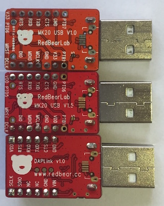

# MK20/DAPLink USB Interface

## PCB Version

### V1.0

For V1.0 version of the MK20 or DAPLink USB dongle, you can update it to the latest interface firmware called DAPLink which is supported and developed by ARM mbed.

Source code:

https://github.com/mbedmicro/DAPLink

### V1.5

For V1.5, you can only use the CMSIS-DAP firmware.

## Updating Interface Firmware
 
In case you have changed the USB interface firmware inside the MK20/DAPLink chip and want to restore to the default one or upgrade to the lastest version, follow the steps below:

1. Press and hold the reset button on your USB dongle board 

2. Connect it to an USB port of your PC 

3. Release the button and the LED will keep flashing (slowly) 

4.1 For Windows, just drag the firmware (.bin) to the MSD drive (e.g. E:), labelled 'BOOTLOADER' (for MK20) or 'MAINTENANCE' (for F103 DAPLink)

4.2 For Linux or Mac OSX (10.9.x), use the follow command from the Terminal:

For MK20 USB:

    Usage:
	dd if=src_firmware.bin of=/Volumes/BOOTLOADER/dst_firmware.bin conv=notrunc

    Example:
	dd if=DAPLink_MK20_BLENano.bin of=/Volumes/BOOTLOADER/DAPLink_MK20_BLENano.bin conv=notrunc

For F103 DAPLink:

    Usage:
	dd if=src_firmware.bin of=/Volumes/MAINTENANCE/dst_firmware.bin conv=notrunc

    Example:
	dd if=DAPLink_F103_BLENano.bin of=/Volumes/MAINTENANCE/DAPLink_F103_BLENano.bin conv=notrunc

4.3 For Mac OSX (10.10.x / 10.11.x):

For MK20 USB:

    sudo mount -u -w -o sync /Volumes/BOOTLOADER; cp -X ~/Desktop/DAPLink_MK20_BLENano.bin /Volumes/BOOTLOADER/

For F103 DAPLink:

    sudo mount -u -w -o sync /Volumes/MAINTENANCE; cp -X ~/Desktop/DAPLink_F103_BLENano.bin /Volumes/MAINTENANCE/

5. Wait for 10 seconds and remove the board from the USB port 

6. Reconnect it to the USB port, your OS will show a drive labelled 'DAPLink' (for DAPLink firmware) or 'MBED' (for CMSIS-DAP firmware)

